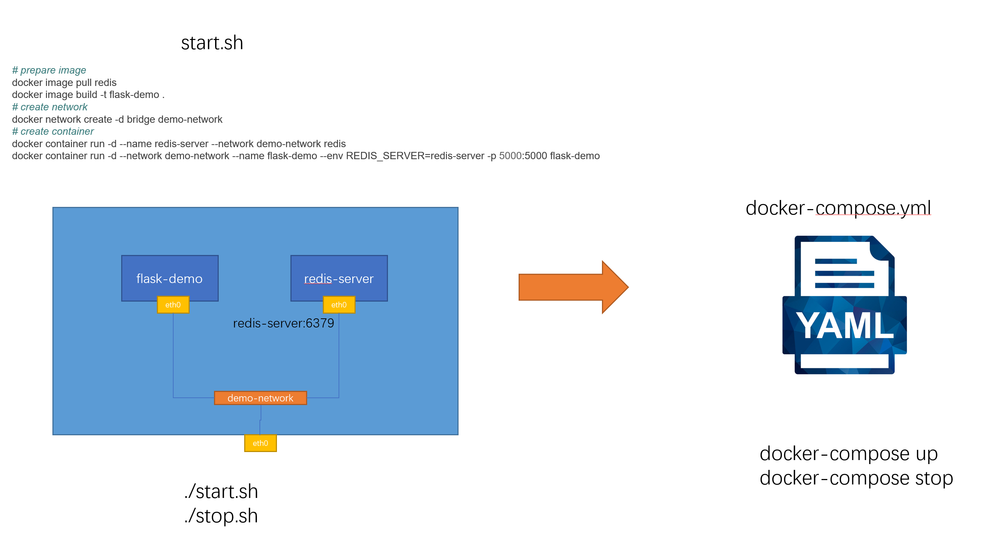
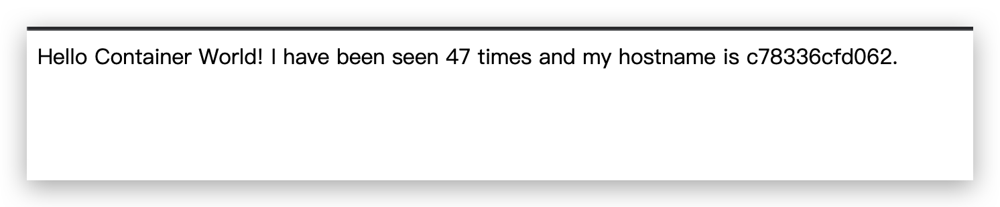

## 7.1 docker-compose 简介



处理多个容器的启动和关闭。可以不用自己去写脚本处理。

## 7.2 docker-compose 的安装

mac 和 windows 在装完 docker desktop 后会默认安装 docker-compose。

```shell
docker-compose --version
```

上面命令会打印出 docker-compose 的版本信息

linux 可以在 [github release](https://github.com/docker/compose/releases) 页面下载安装。

```shell
# 下载 docker-compose，放到 /usr/local/bin 下
sudo curl -L "https://github.com/docker/compose/releases/download/v2.14.0/docker-compose-$(uname -s)-$(uname -m)" -o /usr/local/bin/docker-compose

# 如果 curl 下载贼慢，或者本地下载好后，用 scp 传上去
scp ~/Downloads/docker-compose-linux-x86_64 root@8.131.101.166:/usr/loca
l/bin/docker-compose

# 添加文件的可执行权限
sudo chmod +x /usr/local/bin/docker-compose

# 查看版本信息，确定已经安装
docker-compose --version
```

## 7.3 compose 文件的结构和版本

文档： https://docs.docker.com/compose/compose-file/

```yaml
# docker-compose 的语法版本
version: "3.8"

services: # 容器
  servicename: # 服务名字，这个名字也是内部 bridge网络可以使用的 DNS name
    image: # 镜像的名字
    command: # 可选，如果设置，则会覆盖默认镜像里的 CMD命令
    environment: # 可选，相当于 docker run里的 --env
    volumes: # 可选，相当于docker run里的 -v
    networks: # 可选，相当于 docker run里的 --network
    ports: # 可选，相当于 docker run里的 -p
  servicename2:

volumes: # 可选，相当于 docker volume create

networks: # 可选，相当于 docker network create
```

以第六节 docker 网络中 python-flask + redis 的脚本 demo为例子，改造成一个 docker-compose 文件

```shell
# prepare image
docker image pull redis
docker image build -t flask-demo .

# create network
docker network create -d bridge demo-network

# create container
docker container run -d --name redis-server --network demo-network redis
docker container run -d --network demo-network --name flask-demo --env REDIS_HOST=redis-server -p 80:5000 flask-demo
```

```yml
version: "3.8"

services:
  flask-demo:
    image: flask-demo:latest
    environment:
      - REDIS_HOST=redis-server
    networks:
      - demo-network
    ports: -8080:5000
    redis-server:
      image: redis:latest
      networks:
        - demo-network

networks:
  demo-network:
```

## 7.4 docker-compose 命令行基本使用
```shell
# 前台启动服务
docker-compose up 

# 后台启动服务
docker-compose up -d

# 停止服务
docker-compose stop

# 删除后台已经停止的容器
docker-compose rm

# -p 指令修改容器的前缀，也可在 yml 文件中指定 container_name 写死。
docker-compose -p myproject up -d
```

查看镜像
```log
➜  2.15 docker image ls
REPOSITORY   TAG          IMAGE ID       CREATED          SIZE
flask-demo   latest       0fe4a5f0a768   21 minutes ago   128MB
redis        latest       3358aea34e8c   2 weeks ago      117MB
```

前台启动服务
```log
➜  2.15 docker-compose up
[+] Running 2/2
 ⠿ Container 215-redis-server-1  Created                                                                                          0.2s
 ⠿ Container 215-flask-demo-1    Created                                                                                          0.2s
Attaching to 215-flask-demo-1, 215-redis-server-1
215-redis-server-1  | 1:C 05 Dec 2022 11:14:19.879 # oO0OoO0OoO0Oo Redis is starting oO0OoO0OoO0Oo
215-redis-server-1  | 1:C 05 Dec 2022 11:14:19.881 # Redis version=7.0.5, bits=64, commit=00000000, modified=0, pid=1, just started
215-redis-server-1  | 1:C 05 Dec 2022 11:14:19.882 # Warning: no config file specified, using the default config. In order to specify a config file use redis-server /path/to/redis.conf
215-redis-server-1  | 1:M 05 Dec 2022 11:14:19.883 * monotonic clock: POSIX clock_gettime
215-redis-server-1  | 1:M 05 Dec 2022 11:14:19.889 * Running mode=standalone, port=6379.
215-redis-server-1  | 1:M 05 Dec 2022 11:14:19.889 # Server initialized
215-redis-server-1  | 1:M 05 Dec 2022 11:14:19.889 # WARNING overcommit_memory is set to 0! Background save may fail under low memory condition. To fix this issue add 'vm.overcommit_memory = 1' to /etc/sysctl.conf and then reboot or run the command 'sysctl vm.overcommit_memory=1' for this to take effect.
215-redis-server-1  | 1:M 05 Dec 2022 11:14:19.892 * Ready to accept connections
215-flask-demo-1    |  * Serving Flask app 'app.py'
215-flask-demo-1    |  * Debug mode: off
215-flask-demo-1    | WARNING: This is a development server. Do not use it in a production deployment. Use a production WSGI server instead.
215-flask-demo-1    |  * Running on all addresses (0.0.0.0)
215-flask-demo-1    |  * Running on http://127.0.0.1:5000
215-flask-demo-1    |  * Running on http://172.22.0.2:5000
215-flask-demo-1    | Press CTRL+C to quit
```

容器名字以文件夹的名字 215 作为前缀，-1 作为后缀

后台启动服务
```shell
➜  2.15 docker-compose up -d
[+] Running 2/2
 ⠿ Container 215-redis-server-1  Started                                                                                          1.2s
 ⠿ Container 215-flask-demo-1    Started                                                                                          1.3s
 
➜  2.15 docker-compose ps
NAME                 COMMAND                  SERVICE             STATUS              PORTS
215-flask-demo-1     "flask run -h 0.0.0.0"   flask-demo          running             0.0.0.0:80->5000/tcp, :::80->5000/tcp
215-redis-server-1   "docker-entrypoint.s…"   redis-server        running             6379/tcp
```

如果在启动服务的时候，不通过 -p 来指定 yml 文件，则 docker-compose 命令的执行需要在包含 yml 文件的文件夹下，且名字必须为 docker-compose.yml

## 7.5 docker-compose 镜像构建和拉取

目录结构
```shell
➜  2.15 tree . -L 2
.
├── docker-compose.yml
└── flask
    ├── app.py
    └── Dockerfile.dev

1 directory, 3 files
```

修改后的 docker-compose.yml 文件
```yml
version: "3.8"
services:
  flask-demo:
    build:
      context: ./flask
      dockerfile: Dockerfile.dev
    image: flask-demo:latest
    environment:
      - REDIS_HOST=redis-server
    networks:
      - demo-network
    ports:
      - 80:5000
  redis-server:
    image: redis:latest
    networks:
      - demo-network

networks:
  demo-network:
```

执行 docker-compose build
```log
➜  2.15 docker-compose build
[+] Building 95.1s (9/9) FINISHED
 => [internal] load build definition from Dockerfile.dev                                                                          0.1s
 => => transferring dockerfile: 348B                                                                                              0.0s
 => [internal] load .dockerignore                                                                                                 0.1s
 => => transferring context: 2B                                                                                                   0.0s
 => [internal] load metadata for docker.io/library/python:3.9.5-slim                                                              0.0s
 => [1/4] FROM docker.io/library/python:3.9.5-slim                                                                                0.2s
 => [internal] load build context                                                                                                 0.1s
 => => transferring context: 398B                                                                                                 0.0s
 => [2/4] RUN pip install flask redis &&     groupadd -r flask && useradd -r -g flask flask &&     mkdir /src &&     chown -R f  94.0s
 => [3/4] COPY app.py /src/app.py                                                                                                 0.2s
 => [4/4] WORKDIR /src                                                                                                            0.1s
 => exporting to image                                                                                                            0.3s
 => => exporting layers                                                                                                           0.3s
 => => writing image sha256:c6b31294143743369f2709bbbfaf2506f4ed97eaaa54e4fb8ecae454ccc934c6                                      0.0s
 => => naming to docker.io/library/flask-demo:latest                                                                              0.0s

Use 'docker scan' to run Snyk tests against images to find vulnerabilities and learn how to fix them
```

执行 docker-compose pull 
```shell
➜  2.15 docker-compose pull --ignore-pull-failures
[+] Running 7/8
 ⠿ redis-server Pulled                                                                                                           16.3s
   ⠿ a603fa5e3b41 Pull complete                                                                                                  12.5s
   ⠿ 77631c3ef092 Pull complete                                                                                                  12.6s
   ⠿ ed3847cf62b8 Pull complete                                                                                                  12.8s
   ⠿ 261a8b530567 Pull complete                                                                                                  13.6s
   ⠿ 7d9005a8af6d Pull complete                                                                                                  13.7s
   ⠿ 828da1afb5be Pull complete                                                                                                  13.8s
 ⠿ flask-demo Warning                                                                                                             3.1s
Pulling flask-demo: Error response from daemon: pull access denied for flask-demo, repository does not exist or may require 'docker login': denied: requested access to the resource is denied
```

在拉 flask-demo 的时候会报错，退出进程，从而拉取 redis 失败。可以添加 `--ignore-pull-failures`参数忽略错误，继续拉。

```log
➜  2.15 docker image ls
REPOSITORY   TAG          IMAGE ID       CREATED          SIZE
flask-demo   latest       c6b312941437   40 minutes ago   128MB
redis        latest       3358aea34e8c   2 weeks ago      117MB
```

如果不提前构建镜像，直接起服务，docker-compose up 会自动 build 或者 pull 镜像。

```log
➜  2.15 docker-compose up -d
[+] Running 7/8
 ⠿ flask-demo Warning                                                                                                             3.3s
 ⠿ redis-server Pulled                                                                                                           16.9s
   ⠿ a603fa5e3b41 Pull complete                                                                                                  13.1s
   ⠿ 77631c3ef092 Pull complete                                                                                                  13.3s
   ⠿ ed3847cf62b8 Pull complete                                                                                                  13.4s
   ⠿ 261a8b530567 Pull complete                                                                                                  14.1s
   ⠿ 7d9005a8af6d Pull complete                                                                                                  14.2s
   ⠿ 828da1afb5be Pull complete                                                                                                  14.3s
[+] Building 0.2s (9/9) FINISHED
 => [internal] load build definition from Dockerfile.dev                                                                          0.1s
 => => transferring dockerfile: 36B                                                                                               0.0s
 => [internal] load .dockerignore                                                                                                 0.0s
 => => transferring context: 2B                                                                                                   0.0s
 => [internal] load metadata for docker.io/library/python:3.9.5-slim                                                              0.0s
 => [1/4] FROM docker.io/library/python:3.9.5-slim                                                                                0.0s
 => [internal] load build context                                                                                                 0.0s
 => => transferring context: 28B                                                                                                  0.0s
 => CACHED [2/4] RUN pip install flask redis &&     groupadd -r flask && useradd -r -g flask flask &&     mkdir /src &&     chow  0.0s
 => CACHED [3/4] COPY app.py /src/app.py                                                                                          0.0s
 => CACHED [4/4] WORKDIR /src                                                                                                     0.0s
 => exporting to image                                                                                                            0.0s
 => => exporting layers                                                                                                           0.0s
 => => writing image sha256:c6b31294143743369f2709bbbfaf2506f4ed97eaaa54e4fb8ecae454ccc934c6                                      0.0s
 => => naming to docker.io/library/flask-demo:latest                                                                              0.0s

Use 'docker scan' to run Snyk tests against images to find vulnerabilities and learn how to fix them
[+] Running 2/2
 ⠿ Container 215-flask-demo-1    Started                                                                                          1.8s
 ⠿ Container 215-redis-server-1  Started
```
## 7.6 docker-compose 服务更新

```shell
# 删除在 yml 文件中移除的 service
docker-compose up -d --remove-orphans

# 如果修改了 volume 中的配置文件，restart 重新启动容器，加载配置文件，不会重新 build。
docker-compose restart

# 修改了镜像文件，重新构建 image
docker-compose up -d --build
```

修改上面的 docker-compose yml文件。添加一个 busybox 服务。

```yml
version: "3.8"
services:
  flask-demo:
    build:
      context: ./flak
      dockerfile: Dockerfile.dev
    image: flask-demo:latest
    environment:
      - REDIS_HOST=redis-server
    networks:
      - demo-network
    ports:
      - 80:5000
  redis-server:
    image: redis:latest
    networks:
      - demo-network
  busybox:
    image: busybox:latest
    command: sh -c "while true; do sleep 3600; done"
    networks:
      - demo-network

networks:
  demo-network:
```

重新启动，发现 docker 会自动拉取新的镜像。

```log
➜  2.15 docker-compose up -d
[+] Running 2/2
 ⠿ busybox Pulled                                                                                                                 9.6s
   ⠿ 405fecb6a2fa Pull complete                                                                                                   5.5s
[+] Running 3/3
 ⠿ Container 215-redis-server-1  Running                                                                                          0.0s
 ⠿ Container 215-busybox-1       Started                                                                                          0.8s
 ⠿ Container 215-flask-demo-1    Running                                                                                          0.0s
```

如果将上面的 busybox 从 yml 文件中移除，重新构建服务，会有如下提示。需要使用 --remove-orphans 选项进行清理。

```shell
➜  2.15 docker-compose up -d
WARN[0000] Found orphan containers ([215-busybox-1]) for this project. If you removed or renamed this service in your compose file, you can run this command with the --remove-orphans flag to clean it up.
[+] Running 2/0
 ⠿ Container 215-redis-server-1  Running                                                                                          0.0s
 ⠿ Container 215-flask-demo-1    Running
```

```shell
➜  2.15 docker-compose up -d --remove-orphans
[+] Running 3/1
 ⠿ Container 215-busybox-1       Removed                                                                                         10.3s
 ⠿ Container 215-flask-demo-1    Running                                                                                          0.0s
 ⠿ Container 215-redis-server-1  Running                                                                                          0.0s
```

## 7.7 docker-compose 的网络

```yml
version: "3.8"

services:
  box1:
    image: xiaopeng163/net-box:latest
    command: /bin/sh -c "while true; do sleep 3600; done"
  box2:
    image: xiaopeng163/net-box:latest
    command: /bin/sh -c "while true; do sleep 3600; done"
```

```shell
docker-compose up -d
```

```shell
➜  2.16 docker-compose ps
NAME                COMMAND                  SERVICE             STATUS              PORTS
216-box1-1          "/bin/sh -c 'while t…"   box1                running
216-box2-1          "/bin/sh -c 'while t…"   box2                running
```

进入到 box1 容器，ping box2，测试联通性

```shell
➜  2.16 docker exec -it 216-box1-1 sh
/omd # ping box2
PING box2 (172.25.0.2): 56 data bytes
64 bytes from 172.25.0.2: seq=0 ttl=64 time=0.076 ms
64 bytes from 172.25.0.2: seq=1 ttl=64 time=0.113 ms
64 bytes from 172.25.0.2: seq=2 ttl=64 time=0.115 ms
^C
--- box2 ping statistics ---
3 packets transmitted, 3 packets received, 0% packet loss
round-trip min/avg/max = 0.076/0.101/0.115 ms
```

查看 box1 的 dns 服务器

```log
/omd # dig box2

; <<>> DiG 9.16.33 <<>> box2
;; global options: +cmd
;; Got answer:
;; ->>HEADER<<- opcode: QUERY, status: NOERROR, id: 14452
;; flags: qr rd ra; QUERY: 1, ANSWER: 1, AUTHORITY: 0, ADDITIONAL: 0

;; QUESTION SECTION:
;box2.                          IN      A

;; ANSWER SECTION:
box2.                   600     IN      A       172.25.0.2

;; Query time: 0 msec
;; SERVER: 127.0.0.11#53(127.0.0.11)
;; WHEN: Tue Dec 06 08:54:55 UTC 2022
;; MSG SIZE  rcvd: 42

/omd # more /etc/resolv.conf
nameserver 127.0.0.11
options timeout:2 attempts:3 rotate single-request-reopen ndots:0
```

查看宿主机上的 dns 服务器

```shell
➜  2.16 more /etc/resolv.conf
# Dynamic resolv.conf(5) file for glibc resolver(3) generated by resolvconf(8)
#     DO NOT EDIT THIS FILE BY HAND -- YOUR CHANGES WILL BE OVERWRITTEN
# 127.0.0.53 is the systemd-resolved stub resolver.
# run "systemd-resolve --status" to see details about the actual nameservers.

nameserver 127.0.0.53
options timeout:2 attempts:3 rotate single-request-reopen
```


通过 docker-compose 创建的服务，在容器内部可通过服务的名称（本例为在 yml 文件中定义的 box1，box2)进行相互访问。docker 会自动创建一个 bridge 网络，并会通过自建的 dns 服务器解析 host。

如果在容器内访问的是外部的网站，例如百度。docker 会先通过自己的创建 dns 来进行解析，解析失败后，会继续用宿主机上的 dns 来进行解析。

自定义容器所使用的网络

```yml
version: "3.8"

services:
  box1:
    image: xiaopeng163/net-box:latest
    command: /bin/sh -c "while true; do sleep 3600; done"
    networks:
      - mynetwork1
  box2:
    image: xiaopeng163/net-box:latest
    command: /bin/sh -c "while true; do sleep 3600; done"
    networks:
      - mynetwork1
      - mynetwork2
networks:
  mynetwork1:
    ipam:
      driver: default
      config:
        - subnent: "172.18.238.0/24"
  mynetwork2:
    ipam:
      driver: default
```

https://docs.docker.com/compose/networking/

配置自定义网络，可以实现容器间的网络隔离。

## 7. docker-compose 水平扩展和负载均衡

```shell
docker-compose up -d --scale flask=3
```

```log
➜  2.17 git:(master) tree . -l 2
.
├── docker-compose.yml
├── flask
│   ├── app.py
│   └── Dockerfile
├── nginx
│   └── nginx.conf
```

app.py 文件

```python
from flask import Flask
from redis import Redis
import os
import socket

app = Flask(__name__)
redis = Redis(host=os.environ.get('REDIS_HOST', '127.0.0.1'), port=6379)


@app.route('/')
def hello():
    redis.incr('hits')
    return f"Hello Container World! I have been seen {redis.get('hits').decode('utf-8')} times and my hostname is {socket.gethostname()}.\n"
```

dockerfile 文件

```dockerfile
FROM python:3.9.5-slim

RUN pip install flask redis && \
    groupadd -r flask && useradd -r -g flask flask && \
    mkdir /src && \
    chown -R flask:flask /src

USER flask

COPY app.py /src/app.py

WORKDIR /src

ENV FLASK=app.py REDIS_HOST=redis

EXPOSE 5000

CMD ["flask", "run", "-h", "0.0.0.0"]
```

dokcer-compose.yml 文件

```yml
version: "3.8"

services:
  flask:
    build:
      context: ./flask
      dockerfile: Dockerfile
    image: flask-demo:latest
    environment:
      - REDIS_HOST=redis-server
    networks:
      - backend
      - frontend
  redis-server:
    image: redis:latest
    networks:
      - backend

  nginx:
    image: nginx:stable-alpine
    ports:
      - 80:80
	# 依赖，只有 flask 容器启动后，才能启动 nginx 容器
    depends_on:
      - flask
    volumes:
      - ./nginx/nginx.conf:/etc/nginx/conf.d/default.conf:ro
      - ./var/log/nginx:/var/log/nginx
    networks:
      - frontend

networks:
  backend:
  frontend:
```

启动 docker-compose，生成3个 flask 容器，由 nginx 做前面的 proxy，由 docker 实现负载均衡。

```shell
docker-compose up -d --scale flask=3
```

打开浏览器，访问宿主机的 80 端口，每次刷新，hostname 都会在三个不同的值之间随机变化。



## 7.9 docker-compose 环境变量

修改 docker-compose.yml 文件，让 redis 的连接密码从环境变量中读取

```yml
version: "3.8"

services:
  flask:
    build:
      context: ./flask
      dockerfile: Dockerfile
    image: flask-demo:latest
    environment:
      - REDIS_HOST=redis-server
      - REDIS_PASS=${REDIS_PASS}
    networks:
      - backend
      - frontend
  redis-server:
    image: redis:latest
    command: redis-server --requirepass ${REDIS_PASS}
    networks:
      - backend

  nginx:
    image: nginx:stable-alpine
    ports:
      - 80:80
    depends_on:
      - flask
    volumes:
      - ./nginx/nginx.conf:/etc/nginx/conf.d/default.conf:ro
      - ./var/log/nginx:/var/log/nginx
    networks:
      - frontend

networks:
  backend:
  frontend:
```

创建 .env 文件，并将文件添加到 .gitignore 中。

```env
REDIS_PASS=abc123
```

docker-compose config

```shell
➜  2.17 git:(master) ✗ docker-compose  config
name: "217"
services:
  flask:
    build:
      context: /root/docker/2/2.17/flask
      dockerfile: Dockerfile
    environment:
      REDIS_HOST: redis-server
      REDIS_PASS: abc123
    image: flask-demo:latest
    networks:
      backend: null
      frontend: null
  nginx:
    depends_on:
      flask:
        condition: service_started
    image: nginx:stable-alpine
    networks:
      frontend: null
    ports:
    - mode: ingress
      target: 80
      published: "80"
      protocol: tcp
    volumes:
    - type: bind
      source: /root/docker/2/2.17/nginx/nginx.conf
      target: /etc/nginx/conf.d/default.conf
      read_only: true
      bind:
        create_host_path: true
    - type: bind
      source: /root/docker/2/2.17/var/log/nginx
      target: /var/log/nginx
      bind:
        create_host_path: true
  redis-server:
    command:
    - redis-server
    - --requirepass
    - abc123
    image: redis:latest
    networks:
      backend: null
networks:
  backend:
    name: 217_backend
  frontend:
    name: 217_frontend
```

也可以指定单独的配置文件

```shell
echo 'REDIS_PASS=abc123' > myenv
docker-compose --env-file ./myenv config
docker-compose up -d --env-file ./myenv
```
## 7.10 服务依赖和健康检查

https://docs.docker.com/engine/reference/builder/

### 7.10.1 在 dockerfile 中使用 healthcheck
将上面 dockerfile 构建镜像中使用健康检查

```dockerfile
FROM python:3.9.5-slim

RUN pip install flask redis && \
    apt-get update && apt-get install -y curl && \
    groupadd -r flask && useradd -r -g flask flask && \
    mkdir /src && \
    chown -R flask:flask /src

USER flask

COPY app.py /src/app.py

WORKDIR /src

ENV FLASK=app.py REDIS_HOST=redis

EXPOSE 5000

# 健康检查，测试当前容器服务的连通性
HEALTHCHECK --interval=30s --timeout=3s\
        CMD curl -f http://localhost:5000/ || exit 1

CMD ["flask", "run", "-h", "0.0.0.0"]
```

```shell
# 构建镜像
docker image build -t flask-demo .

# 创建网络
docker network create mybridge

# 生成容器
docker container run -d --name flask1 --env REDIS_HOST=redis-server flask-demo
```

由于 redis 服务未启动，服务内部报错，状态为 unhealth

``` shell
➜  flask git:(master) ✗ docker container ps -a
CONTAINER ID   IMAGE        COMMAND                  CREATED         STATUS                     PORTS      NAMES
ebfaba12bd86   flask-demo   "flask run -h 0.0.0.0"   4 minutes ago   Up 4 minutes (unhealthy)   5000/tcp   flask1

# 查看容器详细信息，可看到容器健康检查的日志
➜  flask git:(master) ✗ docker container inspect flask1
...
"Health": {
                "Status": "unhealthy",
                "FailingStreak": 3,
                "Log": [
                   {
                        "Start": "2022-12-06T20:33:32.959059252+08:00",
                        "End": "2022-12-06T20:33:33.115911813+08:00",
                        "ExitCode": 1,
                        "Output": "  % Total    % Received % Xferd  Average Speed   Time    Time     Time  Current\n                                 Dload  Upload   Total   Spent    Left  Speed\n\r  0     0    0     0    0     0      0      0 --:--:-- --:--:-- --:--:--     0\r  0     0    0     0    0     0      0      0 --:--:-- --:--:-- --:--:--     0\ncurl: (22) The requested URL returned error: 500 INTERNAL SERVER ERROR\n"
                    },
                    {
                        "Start": "2022-12-06T20:34:03.129901079+08:00",
                        "End": "2022-12-06T20:34:03.243209393+08:00",
                        "ExitCode": 1,
                        "Output": "  % Total    % Received % Xferd  Average Speed   Time    Time     Time  Current\n                                 Dload  Upload   Total   Spent    Left  Speed\n\r  0     0    0     0    0     0      0      0 --:--:-- --:--:-- --:--:--     0\r  0     0    0     0    0     0      0      0 --:--:-- --:--:-- --:--:--     0\ncurl: (22) The requested URL returned error: 500 INTERNAL SERVER ERROR\n"
                    },
                    {
                        "Start": "2022-12-06T20:34:33.253949717+08:00",
                        "End": "2022-12-06T20:34:33.376348565+08:00",
                        "ExitCode": 1,
                        "Output": "  % Total    % Received % Xferd  Average Speed   Time    Time     Time  Current\n                                 Dload  Upload   Total   Spent    Left  Speed\n\r  0     0    0     0    0     0      0      0 --:--:-- --:--:-- --:--:--     0\r  0     0    0     0    0     0      0      0 --:--:-- --:--:-- --:--:--     0\ncurl: (22) The requested URL returned error: 500 INTERNAL SERVER ERROR\n"
                    }
                ]
            }
            ...
```

拉取 redis 镜像，构建 redis 容器

```shell
docker image pull redis:latest

docker container run -d --name redis-server --env REDIS_PASS=abc123 redis:latest
```

重新启动 flask1 容器，状态为 health
```log
➜  flask git:(master) ✗ docker container ps -a
CONTAINER ID   IMAGE        COMMAND                  CREATED         STATUS                     PORTS      NAMES
d1a69c24a087   redis        "docker-entrypoint.s…"   2 minutes ago   Up 2 minutes               6379/tcp   redis-server
8d02dfd1b4fb   flask-demo   "flask run -h 0.0.0.0"   3 minutes ago   Up 3 minutes (unhealthy)   5000/tcp   flask1

➜  flask git:(master) ✗ docker container restart 8d0
8d0

➜  flask git:(master) ✗ docker container ps -a
CONTAINER ID   IMAGE        COMMAND                  CREATED         STATUS                             PORTS      NAMES
d1a69c24a087   redis        "docker-entrypoint.s…"   3 minutes ago   Up 3 minutes                       6379/tcp   redis-server
8d02dfd1b4fb   flask-demo   "flask run -h 0.0.0.0"   4 minutes ago   Up 16 seconds (health: starting)   5000/tcp   flask1
```


### 7.10.2 在 docker-compose.yml 中使用健康检查

https://docs.docker.com/compose/compose-file/

```yml
version: "3.8"

services:
  flask:
    build:
      context: ./flask
      dockerfile: Dockerfile
    image: flask-demo:latest
    environment:
      - REDIS_HOST=redis-server
      - REDIS_PASS=${REDIS_PASS}
    healthcheck:
      test: ["CMD", "curl", "-f", "http://localhost:5000"]
      interval: 30s
      timeout: 3s
      retries: 3
      start_period: 40s
    depends_on:
      - redis-server
    networks:
      - backend
      - frontend

  redis-server:
    image: redis:latest
    command: redis-server --requirepass ${REDIS_PASS}
    networks:
      - backend

  nginx:
    image: nginx:stable-alpine
    ports:
      - 80:80
    depends_on:
      flask:
        condition: service_healthy
    volumes:
      - ./nginx/nginx.conf:/etc/nginx/conf.d/default.conf:ro
      - ./var/log/nginx:/var/log/nginx
    networks:
      - frontend

networks:
  backend:
  frontend:

```


condition： 只有在 flask 服务健康检测通过之后，才会继续构建 redis 容器。
```yml
    depends_on:
      flask:
        condition: service_healthy
```


## 7.11 docker-compose 练习