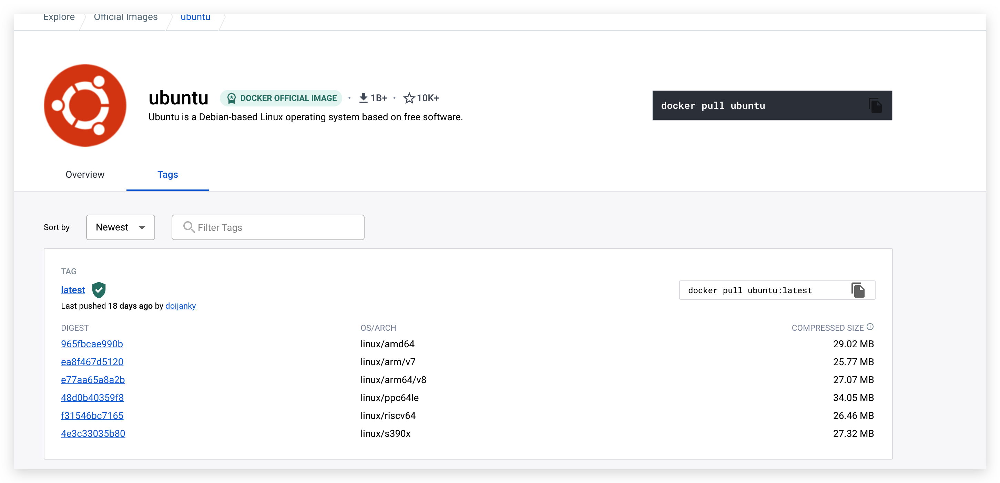
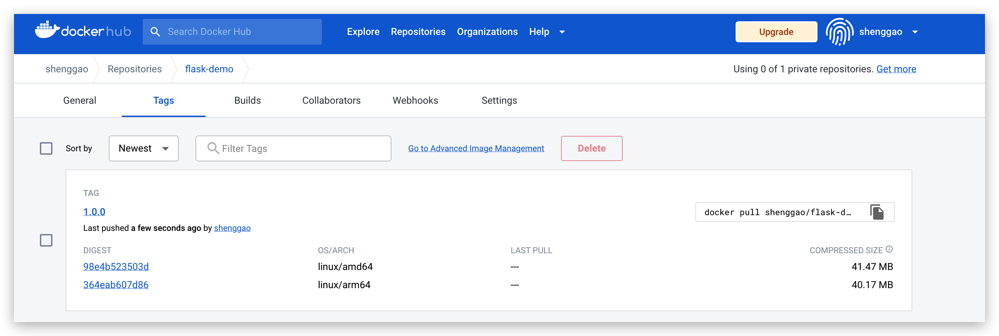

docker 在拉取镜像的时候，默认会拉取适合本地机器架构的版本，arm 架构的机器拉取 arm 版本的镜像，x86 架构的机器拉取 x86 版本的镜像。

那么我们在构建镜像的时候，就需要生成适用于多种架构的镜像。

## 使用 buildx 构建多架构镜像

[项目地址](https://github.com/shenggaowei/docker-start)

登录 dockerhub

```bash
docker login
```

下载项目

```shell
git clone https://github.com/shenggaowei/docker-start
cd docker-start
```

构建
```bash
➜  flask git:(master) docker buildx build --push --platform linux/arm64/v8,linux/amd64 -t shenggao/flask-demo:1.0.0 .
[+] Building 0.0s (0/0)
ERROR: multiple platforms feature is currently not supported for docker driver. Please switch to a different driver (eg. "docker buildx create --use")
```

```bash
➜  flask git:(master) docker buildx create --name mybuilder --use
mybuilder
➜  flask git:(master) docker buildx ls
NAME/NODE    DRIVER/ENDPOINT             STATUS   BUILDKIT PLATFORMS
mybuilder *  docker-container
  mybuilder0 unix:///var/run/docker.sock inactive
default      docker
  default    default                     running  20.10.21 linux/amd64, linux/386
```

```bash
➜  flask git:(master) ✗ docker buildx build --push --platform linux/arm64/v8,linux/amd64 -t shenggao/flask-demo:1.0.0 -f ./Dockerfile.dev .
[+] Building 775.8s (18/18) FINISHED
 => [internal] load build definition from Dockerfile.dev                                                                          0.0s
 => => transferring dockerfile: 276B                                                                                              0.0s
 => [internal] load .dockerignore                                                                                                 0.0s
 => => transferring context: 2B                                                                                                   0.0s
 => [linux/amd64 internal] load metadata for docker.io/library/python:3.9.5-slim                                                  2.1s
 => [linux/arm64 internal] load metadata for docker.io/library/python:3.9.5-slim                                                  1.9s
 => [auth] library/python:pull token for registry-1.docker.io                                                                     0.0s
 => CACHED [linux/arm64 1/4] FROM docker.io/library/python:3.9.5-slim@sha256:9828573e6a0b02b6d0ff0bae0716b027aa21cf8e59ac18a7672  0.0s
 => => resolve docker.io/library/python:3.9.5-slim@sha256:9828573e6a0b02b6d0ff0bae0716b027aa21cf8e59ac18a76724d216bab7ef04        0.0s
 => [internal] load build context                                                                                                 0.0s
 => => transferring context: 27B                                                                                                  0.0s
 => CACHED [linux/amd64 1/4] FROM docker.io/library/python:3.9.5-slim@sha256:9828573e6a0b02b6d0ff0bae0716b027aa21cf8e59ac18a7672  0.1s
 => => resolve docker.io/library/python:3.9.5-slim@sha256:9828573e6a0b02b6d0ff0bae0716b027aa21cf8e59ac18a76724d216bab7ef04        0.0s
 => [linux/arm64 2/4] RUN groupadd -r flask && useradd -r -g flask flask &&     mkdir /src &&     chown -R flask:flask /src       1.0s
 => [linux/amd64 2/4] RUN groupadd -r flask && useradd -r -g flask flask &&     mkdir /src &&     chown -R flask:flask /src       0.5s
 => [linux/amd64 3/4] COPY app.py /src/app.py                                                                                     0.1s
 => [linux/amd64 4/4] WORKDIR /src                                                                                                0.1s
 => [linux/arm64 3/4] COPY app.py /src/app.py                                                                                     0.1s
 => [linux/arm64 4/4] WORKDIR /src                                                                                                0.1s
 => exporting to image                                                                                                          772.3s
 => => exporting layers                                                                                                           0.4s
 => => exporting manifest sha256:364eab607d86ef15cbd5a0e4e9b7877949f9b204ccb39080ea5f24d7ffe98bf1                                 0.0s
 => => exporting config sha256:37908b2b5235b5b07ca504ed1bd635c7a1442261d45db8062dae6e66b3fec9cb                                   0.0s
 => => exporting manifest sha256:98e4b523503dfae188929e638b7e7746be797802786191e710d0bdc2bff74761                                 0.0s
 => => exporting config sha256:c877c97af92475cc4d6d926a408ab6a12357f632546eec380a077631d7eb98b8                                   0.0s
 => => exporting manifest list sha256:ac310a01c54497c10cc5746dc731441330d571086783029c482e2d06d4391ad7                            0.0s
 => => pushing layers                                                                                                           768.9s
 => => pushing manifest for docker.io/shenggao/flask-demo:1.0.0@sha256:ac310a01c54497c10cc5746dc731441330d571086783029c482e2d06d  2.8s
 => [auth] shenggao/flask-demo:pull,push token for registry-1.docker.io                                                           0.0s
 => [auth] shenggao/flask-demo:pull,push token for registry-1.docker.io                                                           0.0s
 => [auth] shenggao/flask-demo:pull,push token for registry-1.docker.io                                                           0.0s
```


buildx 会拉取 moby/buildkit 镜像，在其生成的容器中进行构建。
```bash
➜  ~ docker container ps
CONTAINER ID   IMAGE                           COMMAND       CREATED         STATUS         PORTS     NAMES
d48604d7a495   moby/buildkit:buildx-stable-1   "buildkitd"   9 minutes ago   Up 9 minutes             buildx_buildkit_mybuilder0
```

构建完成后，登陆 dockerhub 查看。

