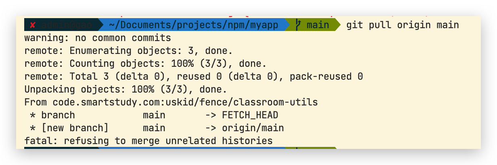

# git 使用问题记录

## 1 新项目,拉取远程代码时报错。

解决方案：

```shell
git pull origin main --allow-unrelated-histories
```

> By default, git merge command refuses to merge histories that do not share a common ancestor. This option can be used to override this safety when merging histories of two projects that started their lives independently. As that is a very rare occasion, no configuration variable to enable this by default exists and will not be added.
>
> Only useful when merging.

通过[文档](https://git-scm.com/docs/git-pull)可知，**如果两个项目没有共同的远程仓库，且是两个独立启动的项目，git 将会阻止其进行合并**。

## 2 .gitignore 修改后不生效

若没有生效，是因为 .gitignore 只能忽略那些原来没有被 track 的文件，如果某些文件已经被纳入了版本管理中，则修改 .gitignore 是无效的。

解决方法是先把本地缓存删除，然后再提交。

```shell
git rm -r --cached .
git add .
git commit -m"update .gitignore"
git push -u origin master
```
