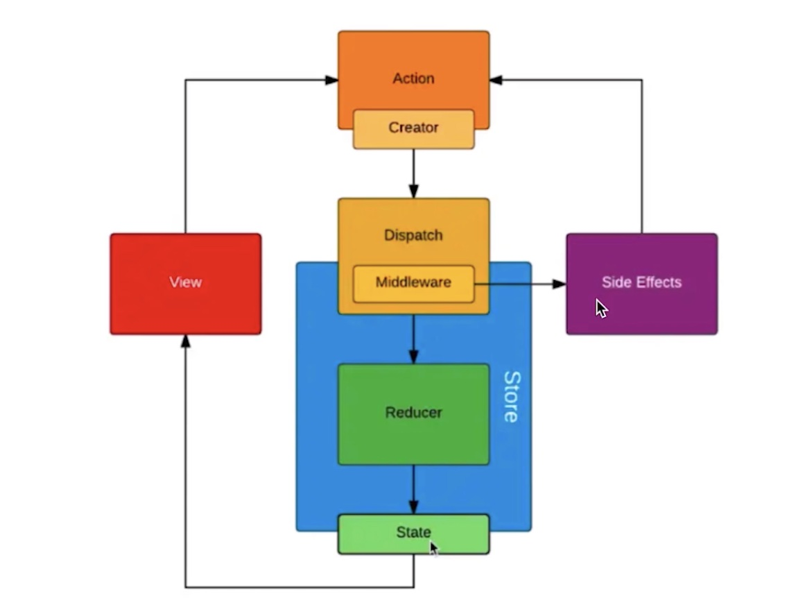

## 1 函数组件和 class 组件的区别

1.  纯函数，输入 props， 输出 jsx。
2.  没有实例，没有生命周期，没有 state（可通过 hook 进行补充）。
3.  不能扩展其他方法。

## 2 什么是非受控组件和受控组件

- 受控组件，状态通过 state 进行控制。
- 非受控组件，状态通过 state 进行控制。
  - ref/defaultValue defaultCheck/手动操作 dom。
  - Input type="file" 只能通过非受控组件进行控制。
  - 富文本的实现。操作 dom 实现样式。

## 3 portals 使用场景

将子节点渲染到存在于父组件以外的 dom 节点的优秀的方案。（常用于处理 css 渲染问题）。

- 父组件有 overflow:hidden 或 z-index 样式时，子组件能够在视觉上“跳出”其容器。例如，对话框、悬浮卡以及提示框。
- Fixed 需要放到 body 的第一层级。（弹窗）

## 4 context 的用法和使用场景

跨组件层级共享全局数据。将公共信息（语言、主题，地区偏好）传递给组件。

相比较而言，用 props 太繁琐，用 redux 小题大做，过度设计。

从 provider 到其内部 consumer 组件的传播不受制于 shouldComponentUpdate 函数，因此当 consumer 组件在其祖先组件跳过更新的情况下也能更新。

```jsx
   // base 创建 context 对象（React.createContext）
   const MyContext = React.createContext(defaultValue);

   // 1 创建生产者 (Context.Provider)
   <MyContext.Provider value={}></MyContext.Provider>

   // 2.1 Class.contextType
   class MyClass extends React.Component {
     //或者 static contextType = MyContext
     render() {
       let value = this.context;
       /* 基于 MyContext 组件的值进行渲染 */
     }
   }
   MyClass.contextType = MyContext;

   // 2.2.1 Context.Consumer
   function MyFunction() {
     return <MyContext.Consumer>
       {value => /* 基于 context 值进行渲染 */}
     </MyContext.Consumer>
   }

   //2.2.2 useContext
   function MyFunction() {
     const value = React.useContext(MyContext)
     return <div>{value}</div>
   }
```

## 5 异步组件

作用：可用于进行代码分割，做性能优化，懒加载代码模块。

懒加载示例

```tsx
import React from "react";
const AsyncFool = React.lazy(() => import("./fool"));
// 懒加载示例
const AsyncComponent: React.FC = () => {
  return (
    <React.Suspense fallback={<div>loading</div>}>
      <AsyncFool />
    </React.Suspense>
  );
};

export default AsyncComponent;
```

基于路由的懒加载示例

```tsx
import React, { Suspense, lazy } from "react";
import { BrowserRouter as Router, Routes, Route } from "react-router-dom";
const Home = lazy(() => import("./routes/Home"));
const About = lazy(() => import("./routes/About"));

const App = () => (
  <Router>
    <Suspense fallback={<div>Loading...</div>}>
      <Routes>
        <Route path="/" element={<Home />} />
        <Route path="/about" element={<About />} />
      </Routes>
    </Suspense>
  </Router>
);
```

## 6 性能优化

- scu
  - 默认值返回 true，即默认重新渲染所有子组件。
  - scu 需要结合**不可变值**使用。
    - 函数式编程思想。如果使用可变值，在前后 props 对比中，引用一致，不触发渲染。
  - scu 不一定每次都用。需要的时候才优化。尽量减少 state 的层级。
- pureComponent/React.memo
  - purComponent, scu 中实现了浅比较。深比较耗费性能。
  - React.memo 为高阶组件。默认只对 props 做浅比较，如果要控制对比过程，可将自定义比较函数 作为第二个参数传入 React.memo 中。
- 不可变值 immutable.js
  - 彻底拥抱“不可变值”。
  - 基于共享数据（不是深拷贝），速度好。
  - 有一定学习和迁移成本，按需使用。

## 7 高阶组件 hoc

```jsx
   const HOCFactory = (Component) => {
     class HOC extends React.Component {
       // 在此定义多个组件的公共逻辑
       render {
         return <Component {...this.props} />
       }
     }
   	return HOC
   }
```

高阶组件是参数为组件，返回值为新组件的函数。

- 不能改变原始组件，应该使用组合
- 将不相关的 props 传递给被包裹的组件（透传 props）
- 会增加组件的嵌套。包装显示名称以便轻松调试
- 不能在 render 中使用 hoc
  - 重新挂载组件会导致该组件及其所有子组件的状态丢失
- 务必复制静态方法
- Refs 不会被传递。通过 react.forwardref 处理

## 8 render props

将 class 组件的 state 作为 props 传递给函数式组件。

```jsx
class Factory extends React.Component {
  constructor(props) {
    super(props);
    this.state = {};
  }
  render() {
    return <div>{this.props.render(this.state)}</div>;
  }
}

function APP() {
  return (
    <Factory
      render={(props) => {
        return <div></div>;
      }}
    />
  );
}
```

## 9 redux(异步 action)

- redux-thunk
- redux-promise
- redux-saga

## 10 Redux 数据流



## 11 react 为何不能直接修改 state?

符合函数式编程（纯函数）思想

## 12 setState 可能是异步更新？

1.  同步。setTimeout 和 自定义的 dom 事件中使用 setState。(setInterval??)
2.  异步。直接使用 setState。

## 13 setState 被合并的条件？

1.  合并。传入对象。

    ```jsx
    class extends React.Component {
      constructor(props){
        super(props)
        this.state = {
          count: 0
        }
      }

      increase = () => {
        this.setState({
          count: this.state.count + 1
        })
        this.setState({
          count: this.state.count + 1
        })
        this.setState({
          count: this.state.count + 1
        })
        // 1
      }

      render() {
        return <button onClick={this.increase}>{this.state.count}</button>
      }
    }
    ```

2.  不合并。传入函数。

    ```jsx
    class extends React.Component {
      constructor(props){
        super(props)
        this.state = {
          count: 0
        }
      }

      increase = () => {
        this.setState((prevState, props) => {
          return {
            count: prevState.count + 1
          }
        })
        this.setState((prevState, props) => {
          return {
            count: prevState.count + 1
          }
        })
       this.setState((prevState, props) => {
          return {
            count: prevState.count + 1
          }
        })
        // 3
      }

      render() {
        return <button onClick={this.increase}>{this.state.count}</button>
      }
    }
    ```

## 14 react 性能优化

详见文章 [react 性能优化](../library/react/optimize/readme.md)
