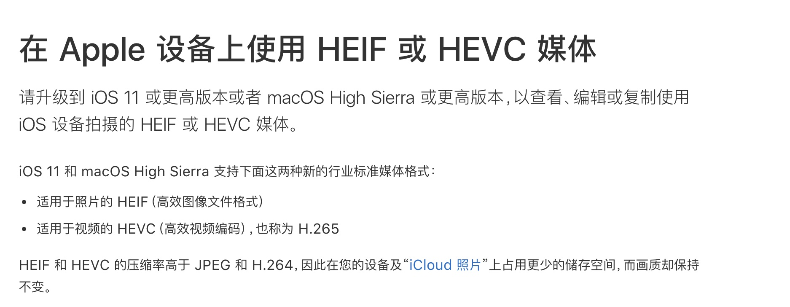

# 视频编码

## h.264

H.264，又称为 MPEG-4 第10部分，高级视频编码，是一种面向快，基于运动补偿的视频编码标准。到2014年，它已经成为高精度视频录制、压缩和发布的最常用格式之一。

### 1 H264的发展历史

首先，所有的视频都一定要进行编码。不经过压缩的视频太大，在网络传输时对带宽的要求和压力太大。

为此，**ITU-T与ISO/IEC是制定视频编码标准的两大组织**，陆续提出了很多视频压缩标准。

ISO/IEC 实际上是两个组织
* ISO：国际标准化组织
* IEC：国际电工委员会

ITU-T与ISO/IEC两大组织在历史上究竟发生了什么有趣的事情呢？

一般认为，ITU-T的H.26x标准，主要应用于实时视频通信领域，如会议电视；ISO/IEC制定的MPEG系列标准，主要应用于视频存储(DVD)、广播电视、因特网或无线网上的流媒体等。

从上图中可以看到几个有趣的事情

* 两个组织也在一起共同制定了一些标准：H.262标准等同于MPEG-2的视频编码标准；H.264标准等同于MPEG-4，并且被收录到第10部分。之前，笔者之前一直不明白，对于『H.264』，为什么有的地方会称呼为『MPEG4 AVC』，整理到这里终于明白了：这个协议是两个组织机构共同指定的，每个机构收录到各自的标准手册中，为了保持命名统一，所以才衍生了H.264和MPEG4 AVC两个名词。而最新的H.264标准则被纳入MPEG-4的第10部分，所以又称MPEG4 Part 10 AVC。
* MPEG3并不存在！从维基百科摘录原因如下：MPEG-3是在制定MPEG-2标准之后准备推出的适用于HDTV（高清晰度电视）的视频、音频压缩标准，但是由于MPEG-2标准已经可以满足要求，故MPEG-3标准并未正式推出。

虽然H264标准等同于MPEG-4，但是为什么网上还有不少关于“H.264和MPEG-4的区别”的讨论呢？

总结如下：
1. 首先，以上提到的都是标准，并不是具体的实现。
2. 其次，很多标准也是在不断演化的，比如MPEG-4，大家应该留意到，有些外文中的说法是“basicMPEG-4 compression”，而且H.264也确实是在后来被ISO收录到MPEG第10卷中的，在那之后，H.264和MPEG才开始保持同步更新的。
3. 最后，不知什么原因，H.264这个名词被大家广泛使用，而MPEG-4似乎就没有这么热门。加上两者名词相差甚远，因此被很多人认为是截然不同的东西也是可能的。

## h.265

H.265, 又称为 MPEG-H 第2部分，高效率视频编码（High Efficiency Video Coding, ，简称 HEVC）

### 1 H265 发展史

第一版的 HEVC/H.265 视频压缩标准在2013年4月13日被接受为国际电信联盟（ITU-T）的正式标准

### 优点

H.265旨在在有限带宽下传输更高质量的网络视频，仅需原先的一半带宽即可播放相同质量的视频。这也意味着，我们的智能手机、平板机等移动设备将能够直接在线播放1080p的全高清视频。H.265标准也同时支持4K（4096×2160）和8K（8192×4320）超高清视频。可以说，H.265标准让网络视频跟上了显示屏“高分辨率化”的脚步。

## h265 兼容性

**ios**

[在 Apple 设备上使用 HEIF 或 HEVC 媒体](https://support.apple.com/zh-cn/HT207022)

**安卓**

[安卓音视频格式兼容性支持](https://developer.android.com/guide/topics/media/media-formats?hl=zh-cn)

## 测试效果

用 ffmpeg 将 h.264视频转成 h.265 后，视频所占用的空间减小一半，但是清晰度，却几乎没有变化。

