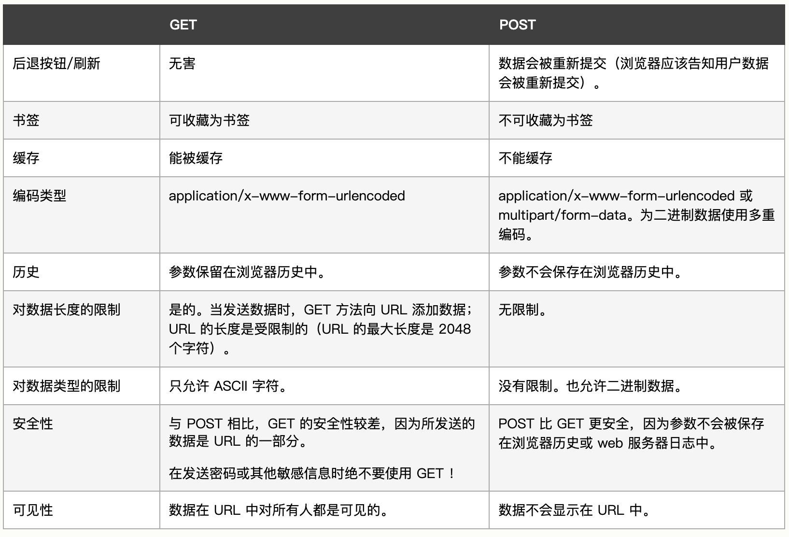

# 网络

## http/1.1 和 http/1.0 区别

1. http/1.1 持久连接在默认情况下是激活的。服务器收到 Connection:close 后，取消连接状态。http/1.0 keep-alive 连接要么是可选的，要么根本就不支持
2. http/1.1 支持管道化连接。请求放入队列中，第一条请求到达服务器时，第二条和第三条请求也可以开始发送了
3. http/1.1 规定请求内的首部字段必须包含 host（一台服主机绑定多个域名，服务器根据 host 判断请求的来源）
4. http/1.1 请求头增加 range 可用于断点续传，它支持只请求资源的某个部分，可用于断点续传
5. http/1.1 新增了 24 个状态码，（如 100Continue，发请求体之前先用请求头试探一下服务器，再决定要不要发请求体）
6. http/1.1 增加请求方法：（OPTIONS,PUT, DELETE, TRACE, CONNECT）
7. 缓存处理。
   1. 强缓存。（不与服务器进行交互）
      1. http/1.0 是 Expires=max-age + 到期时间（该到期时间为绝对时间，依赖于本地的时间，容易被修改）。
      2. http/1.1 是 cache-control=300(s)
   2. 协商缓存。
      1. http/1.0 lastModified/if-modified-since（以 s 为单位，有弊端）
      2. http/1.1 etag/if-none-match()

## http/2.0 和 http/1.x 的区别

1. 服务端推送
2. 多路复用，多个请求都在同一个 tcp 连接上完成
3. 报文头部压缩，http/2.0 可以维护一个字典，差量更新 http 头部，大大降低因头部传输产生的流量

## 三次握手和四次挥手

**三次握手**

1. 请求新的 TCP 连接时， 客户端要向服务器发送一个小的 TCP 分组（通常是 40 ～ 60 个字节）。这个分组中设置了一个特殊的 SYN 标记， 说明这是一个连接请求。
2. 如果服务器接受了连接， 就会对一些连接参数进行计算， 并向客户端回送一个 TCP 分组， 这个分组中的 SYN 和 ACK 标记都被置位， 说明连接请求已被接受。
3. 最后，客户端向服务器回送一条确认信息， ACK 位被标记，通知它连接已成功建立。现代的 TCP 栈都允许客户端在这个确认分组中发送数据。

第一次握手：客户端发送网络包，服务端收到了。这样服务端就能得出结论：客户端的发送能力、服务端的接收能力是正常的。

第二次握手：服务端发包，客户端收到了。这样客户端就能得出结论：服务端的接收、发送能力，客户端的接收、发送能力是正常的。不过此时服务器并不能确认客户端的接收能力是否正常。

第三次握手：客户端发包，服务端收到了。这样服务端就能得出结论：客户端的接收、发送能力正常，服务器自己的发送、接收能力也正常。

**四次挥手**

1. 第一次挥手：客户端发送一个 FIN 报文，报文中会指定一个序列号。此时客户端处于 FIN_WAIT1 状态。
2. 第二次挥手：服务端收到 FIN 之后，会发送 ACK 报文，且把客户端的序列号值 + 1 作为 ACK 报文的序列号值，表明已经收到客户端的报文了，此时服务端处于 CLOSE_WAIT 状态。
3. 第三次挥手：如果服务端也想断开连接了，和客户端的第一次挥手一样，发给 FIN 报文，且指定一个序列号。此时服务端处于 LAST_ACK 的状态。
4. 第四次挥手：客户端收到 FIN 之后，一样发送一个 ACK 报文作为应答，且把服务端的序列号值 + 1 作为自己 ACK 报文的序列号值，此时客户端处于 TIME_WAIT 状态。需要过一阵子以确保服务端收到自己的 ACK 报文之后才会进入 CLOSED 状态
5. 服务端收到 ACK 报文之后，就处于关闭连接了，处于 CLOSED 状态

问：第四次挥手，客户端为什么不直接关闭连接，而是处于 TIME_WAIT 状态？
答：确保服务器收到了客户端的 ACK 报文，如果没有收到的话，服务器会重新发 FIN 报文给客户端，客户端再次收到 FIN 报文之后，就知道之前的 ACK 报文丢失了，然后再次发送 ACK 报文。

## http 常见状态码及其含义

- 1XX：信息状态码
  - 100 Continue 继续，一般在发送 post 请求时，已发送了 http header 之后服务端将返回此信息，表示确认，之后发送具体参数信息
- 2XX：成功状态码

  - 200 OK 正常返回信息
  - 201 Created 请求成功并且服务器创建了新的资源
  - 202 Accepted 服务器已接受请求，但尚未处理

- 3XX：重定向

  - 301 Moved Permanently 请求的网页已永久移动到新位置。
  - 302 Found 临时性重定向。
  - 303 See Other 临时性重定向，且总是使用 GET 请求新的 URI。
  - 304 Not Modified 自从上次请求后，请求的网页未修改过。

- 4XX：客户端错误

  - 400 Bad Request 服务器无法理解请求的格式，客户端不应当尝试再次使用相同的内容发起请求。
  - 401 Unauthorized 请求未授权。
  - 403 Forbidden 禁止访问。
  - 404 Not Found 找不到如何与 URI 相匹配的资源。

- 5XX: 服务器错误
  - 500 Internal Server Error 最常见的服务器端错误。
  - 503 Service Unavailable 服务器端暂时无法处理请求（可能是过载或维护）。

## options 请求

OPTIONS 方法请求 Web 服务器告知其支持的各种功能。可以询问服务器通常支持哪些方法，或者对某些特殊资源支持哪些方法。（有些服务器可能只支持对一些特殊类型的对象使用特定的操作）。

## get 和 post 的区别



- <u>get 产生一个 tcp 数据包，header 和 data 一起发送。post 产生两个数据包，header 先发送，服务器相应后继续发送 data，然后返回数据。（有疑问）</u>

## 用户身份认证方法

- basic 认证
- digest 认证
- ssl 认证
- form 表单认证（服务端在客户端设置 cookie,客户端请求时携带）

**basic 认证**

认证流程：

1. 服务端返回状态码 401,返回带 WWW-Authenticate 首部字段的响应
2. 客户端填写用户名密码后，用“：”进行连接，base64 后放到 Authrozition 首部字段后，发送请求

缺点：

1. 容易解码，在 http 线路上进行 basic 认证，容易被窃听。
2. 想再次进行认证，浏览器无法实现认证注销操作。

**服务端保存用户名密码（salt）**

加密： sha256(sha256(password) + salt)

注册时：

1. 用户提供密码（以及其他用户信息）
2. 系统为用户生成 Salt 值
3. 系统将 Salt 值和用户密码连接到一起
4. 对连接后的值进行散列，得到 Hash 值
5. 将 Hash 值和 Salt 值分别放到数据库中

登录时：

1. 用户提供用户名和密码
2. 系统通过用户名找到与之对应的 Hash 值和 Salt 值
3. 系统将 Salt 值和用户提供的密码连接到一起
4. 对连接后的值进行散列，得到当前的 Hash
5. 比较 Hash 和 当前的 Hash 是否相等，相等则表示密码正确，否则表示密码错误

## http 缓存

详见文章 [《前端本地缓存概况之浏览器缓存策略

》](./js_advance/browser_cache.md)

## https

**http 的问题**

- 通信使用未加密的明文，内容容易被窃取
- 无法验证对方的身份，容易遭遇伪装
- 无法验证报文的完整性，容易被篡改

https 就是为了解决上述 http 协议的安全性问题诞生的。https 并非是应用层的新协议，是基于 http 协议的，将 http 和 tcp 协议接口部分用 SSL 和 TLS 协议代替而已。

```txt
http: http -> tcp -> ip

https: http -> ssl -> tcp -> ip
```
